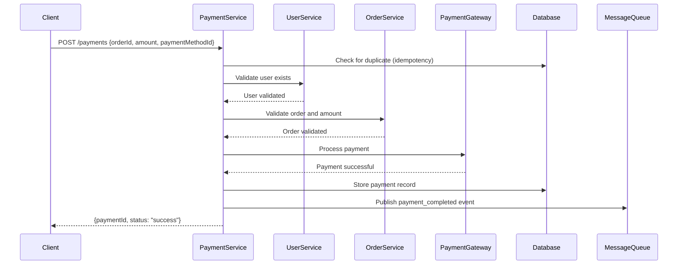
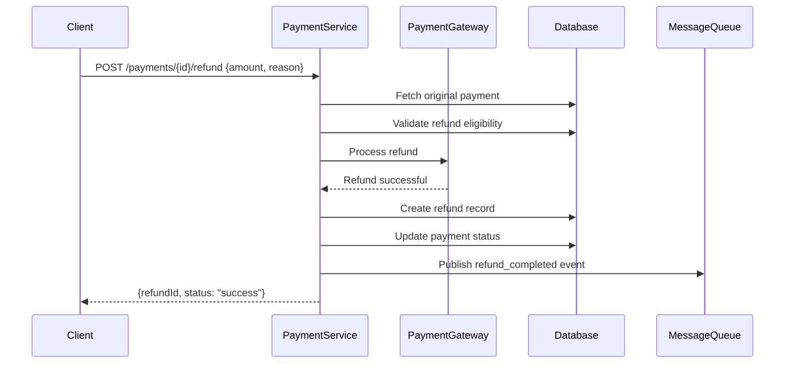
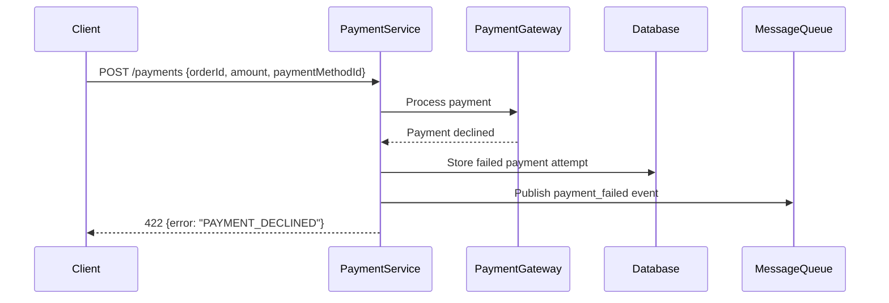
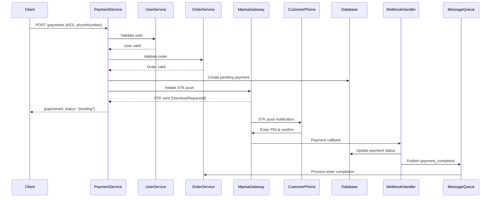

# Payment Service Architecture

## Overview

The Payment Service is a critical microservice in the e-commerce platform responsible for handling all payment-related operations with high reliability, security, and performance requirements.

## 1. Service Boundaries

### What Payment Service Handles

- **Payment Processing**: Credit cards, digital wallets, bank transfers
- **Payment Method Management**: Store, retrieve, and manage user payment methods
- **Refund Processing**: Full and partial refunds with audit trails
- **Transaction History**: Comprehensive payment records and reporting
- **Payment Gateway Integration**: Abstract multiple payment providers
- **Webhook Handling**: Process payment gateway notifications
- **Payment Validation**: Amount validation, duplicate detection
- **Security**: PCI DSS compliance, encryption, tokenization

### What Payment Service Does NOT Handle

- **User Authentication & Management** → User Service responsibility
- **Order Creation & Lifecycle** → Order Service responsibility  
- **Inventory Management** → Inventory Service responsibility
- **Product Catalog** → Product Service responsibility
- **Shipping & Fulfillment** → Fulfillment Service responsibility
- **Tax Calculations** → Tax Service responsibility

### Service Integration Points

- **User Service**: Validate user existence and permissions
- **Order Service**: Validate orders and update payment status
- **Notification Service**: Send payment confirmations and receipts
- **Audit Service**: Log payment events for compliance

---

## 2. API Flows & Dependencies

### POST /payments (Process Payment)

**Purpose**: Initiate a new payment transaction

- **Input**: `{userId, orderId, amount, currency, paymentMethodId, metadata}`
- **Dependencies**:
  - User Service → validate user exists and is active
  - Order Service → validate order exists and amount matches
  - Payment Gateway → process actual payment
  - Database → store transaction record
  - Message Queue → publish payment events
- **Output**: `{paymentId, status, transactionId, estimatedSettlement}`

### POST /payments/{id}/refund (Process Refund)

**Purpose**: Refund a completed payment (full or partial)

- **Input**: `{amount, reason, refundMethod, metadata}`
- **Dependencies**:
  - Database → verify original payment exists and is refundable
  - Payment Gateway → process refund through original provider
  - Database → create refund record and update payment status
  - Message Queue → publish refund events
- **Output**: `{refundId, status, refundAmount, estimatedSettlement}`

### GET /payments/{id} (Get Payment Status)

**Purpose**: Retrieve detailed payment information

- **Input**: `paymentId`
- **Dependencies**:
  - Database → fetch payment record
  - Cache (Redis) → check for cached payment data
- **Output**: `{paymentId, userId, orderId, amount, status, timestamps, gatewayInfo}`

### GET /payments/user/{userId} (User Payment History)

**Purpose**: Retrieve paginated payment history for a user

- **Input**: `userId, limit, offset, dateRange, status`
- **Dependencies**:
  - Database → query user payments with pagination
  - Cache (Redis) → cache frequent queries
- **Output**: `{payments[], totalCount, hasMore, pagination}`

### POST /payment-methods (Add Payment Method)

**Purpose**: Securely store a new payment method for a user

- **Input**: `{userId, type, cardToken, billingAddress, isDefault}`
- **Dependencies**:
  - Payment Gateway → tokenize sensitive data
  - Database → store tokenized payment method
- **Output**: `{paymentMethodId, type, last4, expiryDate, isDefault}`

### GET /payment-methods/user/{userId} (Get User Payment Methods)

**Purpose**: Retrieve user's stored payment methods

- **Input**: `userId`
- **Dependencies**:
  - Database → fetch user's payment methods (tokenized)
- **Output**: `{paymentMethods[], defaultMethodId}`

---

## 3. Error Codes & Response Structure

### Standard Response Format

```json
{
  "success": true,
  "data": {},
  "error": null,
  "timestamp": "2025-08-28T12:00:00Z",
  "requestId": "req_123456"
}
```

### Error Response Format

```json
{
  "success": false,
  "data": null,
  "error": {
    "code": "PAYMENT_FAILED",
    "message": "Payment could not be processed",
    "details": "Insufficient funds",
    "field": "amount"
  },
  "timestamp": "2025-08-28T12:00:00Z",
  "requestId": "req_123456"
}
```

### HTTP Status Codes & Error Mapping

| HTTP Code | Error Code | Description | Example Response |
|-----------|------------|-------------|------------------|
| 200 | SUCCESS | Operation completed successfully | `{"success": true, "data": {...}}` |
| 201 | CREATED | Resource created successfully | `{"success": true, "data": {...}}` |
| 400 | INVALID_REQUEST | Malformed or invalid input | `{"error": {"code": "INVALID_AMOUNT", "message": "Amount must be positive"}}` |
| 401 | UNAUTHORIZED | Missing or invalid authentication | `{"error": {"code": "UNAUTHORIZED", "message": "Invalid API key"}}` |
| 403 | FORBIDDEN | User lacks permission for resource | `{"error": {"code": "INSUFFICIENT_PERMISSIONS", "message": "Cannot access this payment"}}` |
| 404 | NOT_FOUND | Resource does not exist | `{"error": {"code": "PAYMENT_NOT_FOUND", "message": "Payment ID not found"}}` |
| 409 | CONFLICT | Duplicate or conflicting request | `{"error": {"code": "DUPLICATE_PAYMENT", "message": "Payment already processed"}}` |
| 422 | UNPROCESSABLE_ENTITY | Valid format but business logic error | `{"error": {"code": "PAYMENT_DECLINED", "message": "Card declined by issuer"}}` |
| 429 | RATE_LIMITED | Too many requests | `{"error": {"code": "RATE_LIMIT_EXCEEDED", "message": "Too many payment attempts"}}` |
| 500 | INTERNAL_ERROR | Unexpected server error | `{"error": {"code": "INTERNAL_ERROR", "message": "Payment gateway unavailable"}}` |
| 502 | BAD_GATEWAY | Upstream service error | `{"error": {"code": "GATEWAY_ERROR", "message": "Payment provider temporarily unavailable"}}` |
| 503 | SERVICE_UNAVAILABLE | Service temporarily unavailable | `{"error": {"code": "MAINTENANCE_MODE", "message": "Service under maintenance"}}` |

### Payment-Specific Error Codes

- `PAYMENT_DECLINED` - Card or payment method declined
- `INSUFFICIENT_FUNDS` - Not enough balance
- `INVALID_PAYMENT_METHOD` - Payment method invalid or expired
- `DUPLICATE_PAYMENT` - Idempotency violation
- `REFUND_NOT_ALLOWED` - Payment cannot be refunded
- `PARTIAL_REFUND_EXCEEDS` - Refund amount exceeds available amount
- `GATEWAY_TIMEOUT` - Payment gateway timeout
- `CURRENCY_NOT_SUPPORTED` - Currency not supported

---

## 4. Sequence Diagrams

### POST /payments (Successful Payment Flow)



### POST /payments/{id}/refund (Refund Flow)



### Error Handling Flow (Payment Declined)



---

## 5. System Dependencies

### External Dependencies

- **Payment Gateways**: M-pesa, Stripe (primary/fallback)
- **Database**: PostgreSQL (primary data), Redis (caching/sessions)
- **Message Queue**: Redis/RabbitMQ for event publishing
- **Monitoring**: Prometheus metrics, structured logging

### Internal Dependencies

- **User Service**: User validation and profile data
- **Order Service**: Order validation and status updates
- **Notification Service**: Email/SMS confirmations
- **Audit Service**: Compliance and security logging

### Infrastructure Dependencies

- **API Gateway**: Request routing and rate limiting
- **Service Discovery**: Container orchestration
- **Configuration Management**: Environment-specific settings
- **Secrets Management**: Secure storage of API keys and credentials

---

## 6. Security & Compliance

### PCI DSS Requirements

- No storage of sensitive card data (use tokenization)
- End-to-end encryption for all payment data
- Secure key management and rotation
- Regular security audits and vulnerability scanning

### Authentication & Authorization

- API key authentication for service-to-service
- JWT tokens for user-facing endpoints
- Role-based access control (RBAC)
- Rate limiting per user/API key

### Data Protection

- Encryption at rest and in transit
- Payment method tokenization
- PII anonymization for analytics
- GDPR compliance for data deletion

---

## 7. Performance & Scalability Considerations

### Performance Targets

- **Response Time**: < 200ms for 95th percentile
- **Throughput**: 1000+ payments/second
- **Availability**: 99.9% uptime SLA

### Caching Strategy

- Payment method cache (5 minutes TTL)
- User payment history cache (2 minutes TTL)
- Gateway status cache (30 seconds TTL)

### Database Optimization

- Indexed queries on user_id, order_id, status
- Read replicas for payment history queries
- Partitioning for large payment tables
- Connection pooling for high concurrency

### Fault Tolerance Patterns (Week 2+ Implementation)

- Circuit breaker for payment gateway calls
- Retry with exponential backoff
- Bulkhead pattern for resource isolation
- Health checks with dependency monitoring

---

## 8. Mobile Money Integration (M-Pesa Support)

### Enhanced Payment Processing

- **STK Push Integration**: Consumer-to-business payments via mobile phone
- **B2C Refunds**: Business-to-consumer refund processing
- **Asynchronous Payment Flow**: Handle delayed payment confirmations
- **Phone Number Validation**: Validate M-Pesa registered phone numbers

### M-Pesa Specific Dependencies

- **M-Pesa Gateway APIs**:
  - Lipa Na M-Pesa Online (STK Push)
  - B2C Payment API (for refunds)
  - Transaction Status Query API
- **SSL Certificate Management**: M-Pesa requires specific SSL certificates
- **Webhook Processing**: Handle M-Pesa callback notifications
- **IP Whitelisting**: Static IP requirements for M-Pesa integration

### Enhanced Payment States

```
Traditional: [pending, processing, success, failed, cancelled, refunded]
Enhanced: [pending, stk_sent, processing, success, failed, cancelled, expired, refunded, partially_refunded]
```

---

## 9. Multi-Currency Support

### Currency Support Matrix

| Currency | Gateways | Min Amount | Max Amount | Decimal Places |
|----------|----------|------------|------------|----------------|
| USD | Stripe, PayPal, Square | $0.50 | $999,999 | 2 |
| EUR | Stripe, PayPal | €0.50 | €999,999 | 2 |
| GBP | Stripe | £0.30 | £999,999 | 2 |
| KES | M-Pesa | KES 1 | KES 70,000 | 0 |

### Currency Service Integration

- **Real-time Exchange Rates**: For multi-currency transactions
- **Currency Validation**: Ensure supported currency for payment method
- **Settlement Currency**: Handle currency conversion for reporting

---

## 10. Enhanced Error Handling

### Mobile Money Specific Error Codes

| Error Code | HTTP Status | Description | Recovery Action |
|------------|-------------|-------------|-----------------|
| `MPESA_TIMEOUT` | 408 | STK push timed out | Allow customer retry |
| `MPESA_INVALID_PHONE` | 400 | Invalid phone number format | Request phone correction |
| `MPESA_INSUFFICIENT_FUNDS` | 422 | Insufficient M-Pesa balance | Suggest alternative payment |
| `MPESA_TRANSACTION_FAILED` | 422 | General M-Pesa failure | Allow retry or alternative |
| `MPESA_GATEWAY_UNAVAILABLE` | 503 | M-Pesa API unavailable | Use fallback or retry later |
| `CURRENCY_NOT_SUPPORTED` | 400 | Currency not supported by gateway | Route to appropriate gateway |

---

## 11. Enhanced Data Architecture

### Enhanced Payment Schema

```sql
-- Core payments table with mobile money support
payments {
  payment_id VARCHAR(50) PRIMARY KEY,
  user_id VARCHAR(50) NOT NULL,
  order_id VARCHAR(50) NOT NULL,
  amount DECIMAL(12,2) NOT NULL,
  currency VARCHAR(3) NOT NULL,
  status VARCHAR(20) NOT NULL,
  gateway VARCHAR(20) NOT NULL, -- stripe, paypal, mpesa
  created_at TIMESTAMP DEFAULT NOW(),
  expires_at TIMESTAMP, -- For STK push expiration
  gateway_transaction_id VARCHAR(100),
  mpesa_checkout_request_id VARCHAR(100), -- M-Pesa specific
  mpesa_receipt_number VARCHAR(50), -- M-Pesa receipt
  phone_number_hash VARCHAR(255) -- Encrypted phone number
}
```

### Mobile Money Payment Methods

```sql
-- New table for mobile money methods
mobile_money_methods {
  method_id VARCHAR(50) PRIMARY KEY,
  user_id VARCHAR(50) NOT NULL,
  provider VARCHAR(20) NOT NULL, -- safaricom, airtel, etc
  phone_number_hash VARCHAR(255) NOT NULL,
  account_name VARCHAR(100),
  is_active BOOLEAN DEFAULT true,
  is_default BOOLEAN DEFAULT false,
  created_at TIMESTAMP DEFAULT NOW(),
  updated_at TIMESTAMP DEFAULT NOW()
}
```

---

## 12. Enhanced Sequence Diagrams

### M-Pesa STK Push Payment Flow



---

## 13. Operational Considerations

### Mobile Money Operations

- **Daily Reconciliation**: Match internal records with M-Pesa statements
- **Certificate Management**: M-Pesa SSL certificates (annual renewal)
- **Rate Limiting**: M-Pesa API rate limits require queuing
- **Settlement Monitoring**: Track M-Pesa fund settlement
- **Scheduled Maintenance**: Handle M-Pesa downtime windows

### Enhanced Monitoring & Alerting

- Gateway-specific success rates and latency
- M-Pesa STK push completion rates
- Payment expiration rates
- Currency-specific transaction volumes
- Mobile money settlement tracking

---

## 14. Infrastructure Requirements

### Required Infrastructure Updates

- **SSL Certificate Storage**: Secure M-Pesa certificate management
- **Static IP Requirements**: M-Pesa requires whitelisted IPs
- **Webhook Queue**: High-throughput mobile money callback processing
- **Enhanced Monitoring**: Mobile money specific metrics
- **Currency Rate Service**: Real-time exchange rate updates

### Environment Configuration

```yaml
mpesa:
  environment: sandbox # or production
  consumer_key: ${MPESA_CONSUMER_KEY}
  consumer_secret: ${MPESA_CONSUMER_SECRET}
  lipa_na_mpesa:
    business_short_code: "174379"
    passkey: ${MPESA_PASSKEY}
    callback_url: "${BASE_URL}/webhooks/mpesa"
  b2c:
    initiator_name: ${MPESA_INITIATOR_NAME}
    security_credential: ${MPESA_SECURITY_CREDENTIAL}
  timeout_seconds: 30
  max_retries: 3
```
